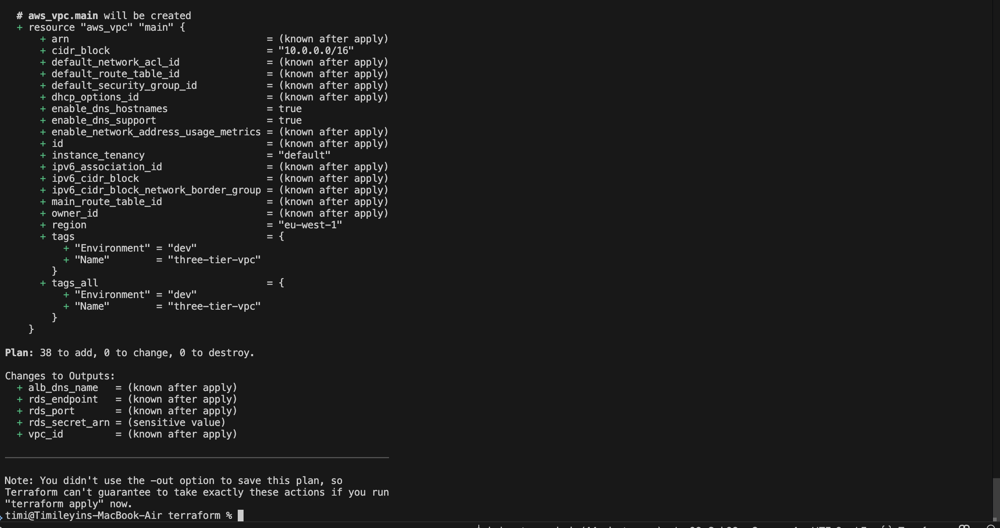
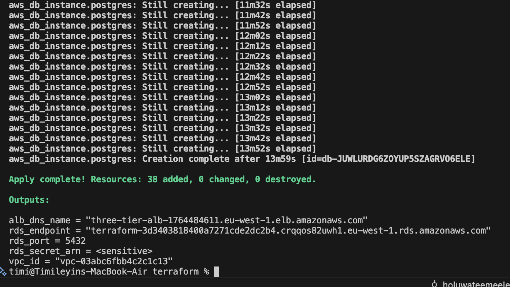
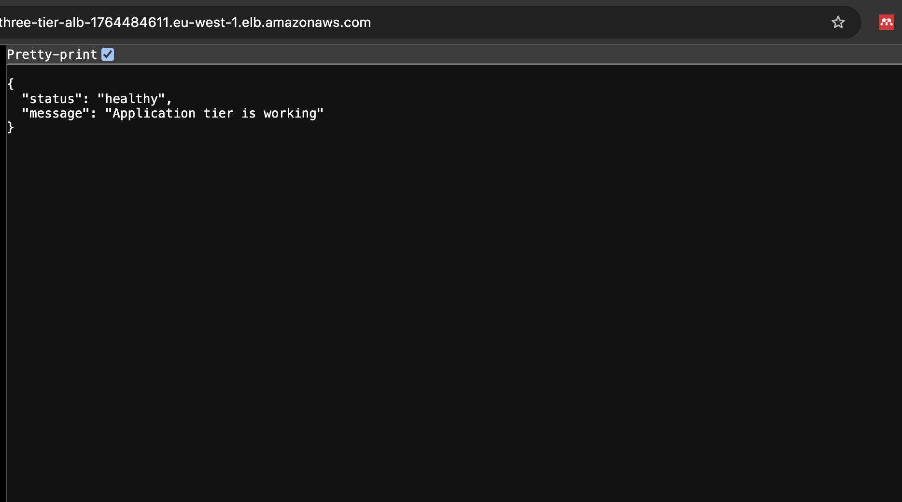

SCENARIO: Your company is launching a new web application. The CTO has asked you to design and deploy a production-ready three-tier architecture on AWS: a web tier (Nginx), an application tier (Node.js), and a database tier (RDS PostgreSQL). The architecture must be highly available across two availability zones.

### Terraform plan 

- Terraform plan showing the planned deployment of 38 AWS resources with no changes or deletions.

#### Terraform Apply
- Terraform apply output CLI

##### Browser output when you visit:
http://three-tier-alb-1764484611.eu-west-1.elb.amazonaws.com

- Application validation: Request successfully passed through the public Application Load Balancer, private Nginx web tier, and private Node.js application tier.

